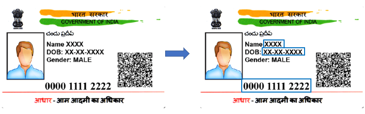
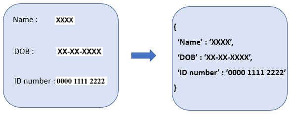
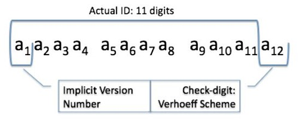

# Aadhaar-card-Character-Recognition

Here, we are going to use OCR technology to recognize the characters printed on the card. This project extracts text from a picture of an Aadhar Card. It takes an image (i.e. a jpg or png file) as an argument to the command and validates if the image is an Aadhar Card or not by providing the Aadhar number from the image. It extracts information from the image like name of the card holder, date of birth or year of birth, whichever is available and the Aadhar card number.

First the image of Aadhaar card is passed into YOLO. Then, YOLO detects the required text regions and crops them out from the image. Later, we pass those regions one by one to tesseract. Tesseract reads them, and we store that information.

## Features
1. Text detection using YOLO (Identifies Regions of Interest (ROI) containing the required information.)
2. Text recognition using pytesseract (OCR on the identified region of interest.)
3. Cropping the ROI using Opencv
4. Aadhaar number validation using Verhoeff Algorithm
5. Store the results from Tesseract in required format
6. UI using streamlit framework

## Requirements:

OpenCv

pytesseract

numpy

## Algorithm
### 1. Text Detection

Our first task is to detect the required text from images/documents. Often, as the need is, you don’t want to read the entire document, rather just a piece of information like credit card number, Aadhaar/PAN card number, name, amount and date from bills, etc. Detecting the required text is a tough task but thanks to deep learning, we’ll be able to selectively read text from an image.

Text detection or in general object detection has been an area of intensive research accelerated with deep learning. Today, object detection, and in our case, text detection, can be achieved through two approaches.

i.  Region-Based detectors

ii. Single Shot detectors

In Region-Based methods, the first objective is to find all the regions which have the objects and then pass those regions to a classifier, which gives us the locations of the required objects. So, it is a two-step process. Firstly, it finds the bounding box and afterwards, the class of it. This approach is considered more accurate but is comparatively slow as compared to the Single Shot approach. Algorithms like Faster R-CNN and R-FCN take this approach.

Single Shot detectors, however, predict both the boundary box and the class at the same time. Being a single step process, it is much faster. However, it must be noted that Single Shot detectors perform badly while detecting smaller objects. SSD and YOLO are Single Shot detectors.

Often, there is a tradeoff between speed and accuracy while choosing the object detector. For example, Faster R-CNN has the highest accuracy, while YOLO is fastest among all. To decide which one to use, totally depends on application. Here, we are using YOLOv3 mainly because, no one can beat it when it comes to speed, has good enough accuracy for our application and YOLOv3 has Feature Pyramid Network (FPN) to detect small objects better.

#### Using YOLO for Text Detection

YOLO is a state-of-the-art, real-time object detection network. There are many versions of it. YOLOv3 is the most recent and the fastest version.
YOLOv3 uses Darknet-53 as it’s feature extractor. It has overall 53 convolutional layers, hence the name ‘Darknet-53’. It has successive 3 × 3 and 1 × 1 convolutional layers and has some shortcut connections.

For the purpose of classification, independent logistic classifiers are used with the binary cross-entropy loss function.

### 2. Cropping the ROI

The co-ordinates of the top-left and bottom-right of the bounding boxes along with the class labels are obtained from the prediction of YOLO. We used opencv to crop the bounding boxes containing the Name, ID number and DOB.

Thus we obtain the key (label from YOLO) and value (cropped image) pair as per the requirement of the project.

### 3. Text Recognition

Now that we have our custom text detector implemented for text detection, we move onto the subsequent process of Text Recognition. We can either build our own text recognizer or use an open-sourced one.

Here we are going to use an open-sourced one, the Tesseract OCR engine for text recognition. With only a few tweaks, the Tesseract OCR engine works wonders for our application. We are going to use Tesseract 4, which is the latest version.

### 4. Aadhaar number validation

Aadhaar number is generated using checksum algorithm and generation of checksum is done by Verhoeff algorithm. Hence we have to use checksum to validate aadhaar number.  The Verhoeff algorithm is a complicated one, and cannot be calculated manually.

## YOLO

YOLO is a new approach to object detection. Prior work on object detection repurposes classifiers to perform detection. Instead, YOLO frame the object detection as a regression problem to spatially separated bounding boxes and associated class probabilities. A single neural network predicts bounding boxes and class probabilities directly from full images in one evaluation. Since the whole detection pipeline is a single network, it can be optimized end-to-end directly on detection performance.
This unified architecture is extremely fast. 

Base YOLO model processes images in real-time at 45 frames per second. A smaller version of the network, Fast YOLO, processes an astounding 155 frames per second while still achieving double the mAP of other real-time detectors. Compared to state-of-the-art detection systems, YOLO makes more localization errors but is far less likely to predict false detections where nothing exists. Finally, YOLO learns very general representations of objects. It outperforms all other detection methods, including DPM and R-CNN, by a wide margin when generalizing from natural images to artwork on both the Picasso Dataset and the People-Art Dataset.

## Pytesseract

Pytesseract is a Python package that allows you to extract text from images. If you have a picture that has some text in it, pytesseract can pull out the text into a Python program. That's pretty cool. Pytesseract is a wrapper around a program from Google called tesseract. It's tesseract that extracts the text from pictures. Pytesseract is there to help you use tesseract in your Python programs.

### Tesseract

Tesseract is a command-line application created by Google that can be used to pull text out of pictures. It is an example of an OCR application, which stands for Optical Character Recognition. Which is just a fancy way of saying using a computer to read text. Tesseract is capable of reading text in many different languages. It works best with computer-generated text like text in PDFs or pictures of receipts and invoices. It has a tougher time with images that contain handwritten words.

### How to install pytesseract

Tesseract installer for Windows:
https://github.com/UB-Mannheim/tesseract/wiki

pytesseract.pytesseract.tesseract_cmd = 'path'+'\\tesseract.exe'

## What is Aadhaar?

https://uidai.gov.in/

Aadhaar is a 12-digit unique identity number that can be obtained voluntarily by residents or passport holders of India, based on their biometric and demographic data. The data is collected by the Unique Identification Authority of India (UIDAI), a statutory authority established in January 2009 by the government of India. Aadhaar is the world’s largest biometric ID system. The Aadhaar card consists of key information on the person such as the name, gender, and date of birth in plain text as well as a QR code. UIDAI has introduced a new Secure QR Code which contains demographic details of a resident like name, address, date of birth, gender and masked Aadhaar number as well as a photograph of the Aadhaar number holder.

### How Aadhar number is generated and validated?
[Aadhar number generation and validation process](https://medium.com/@krs.sharath03/how-aadhar-number-is-generated-and-validated-3c3e7172e606)

The Aadhaar is a unique one-time government-issued identity card. It is a 12-digit random number that records the individual’s biometric and demographic data. Aadhaar Generation involves process like a quality check, packet validation, demographic and biometric de-duplication etc. Aadhaar is generated successfully only if:

1. Quality of enrolment data meets prescribed standards laid down by UIDAI.
    
2. The enrolment packet passes all the validations done in CIDR.
    
3. No Demographic/Biometric duplicate is found.
    
Aadhaar number consists of 12 digits. In that 11 Digits are uniquely generated and the last digit is the checksum.
  
#### How checksum is generated and validated?

Generating checksum is done by Verhoeff_algorithm. The Verhoeff algorithm’s most common usage is in the UIDAI-Aadhaar number generation program. The Verhoeff algorithm is a complicated one, and cannot be calculated manually. This is suitable for computer-era.

The Verhoeff algorithm, a checksum formula for error detection first published in 1969, was developed by Dutch mathematician Jacobus Verhoeff. Like the more widely known Luhn algorithm, it works with strings of decimal digits of any length. It detects all single-digit errors and all transposition errors involving two adjacent digits.

As 100 crores+ Aadhaar numbers will be generated, the Verhoeff Algorithm was the chosen one. And, it is not expected that anyone will try to manually validate the Aadhaar number.

## Streamlit
[streamlit.io](https://streamlit.io/)

Streamlit is an open-source Python library that makes it easy to create and share beautiful, custom web apps for machine learning and data science. In just a few minutes we can build and deploy powerful data apps.

## References

1. [Information Extraction from ID Cards — Using YOLOv2](https://blog.francium.tech/information-extraction-from-id-cards-using-yolov2-e3c846cb3796)

2. PyraDox 
 
PyraDox is a simple tool which helps in document digitization by extracting text information and masking of personal information with the help of Tesseract-ocr.

[Using flask](https://github-dotcom.gateway.web.tr/festivitymishra/PyraDox), [Using streamlit](https://github.com/festivitymishra/PyraDox-frontend)

3. [Custom OCR using YOLO and Tesseract: Medium](https://medium.com/saarthi-ai/how-to-build-your-own-ocr-a5bb91b622ba)
